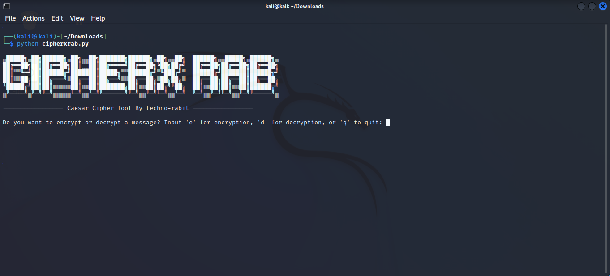
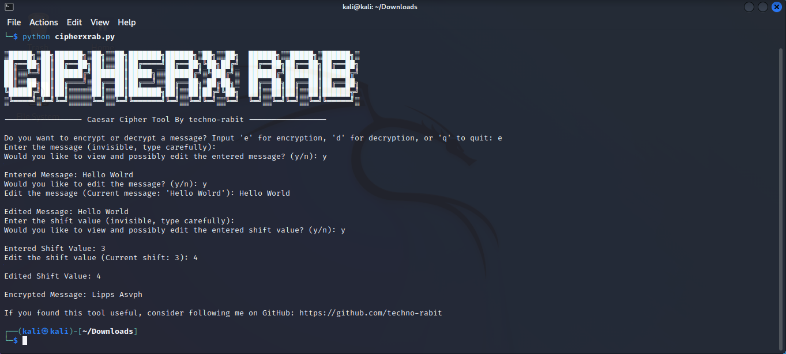

# PRODIGY_CS_01

<p align="center">
<a href="#"></a>
</p>
<p align="center">
<a href="https://github.com/techno-rabit"></a>
<a href="https://prodigyinfotech.dev/"></a>
</p>

# CIPHERX RAB ( Caesar Cipher Tool )

This Python-based Caesar Cipher tool efficiently handles both encryption and decryption of messages using the traditional Caesar Cipher method. It was developed as part of my internship at Prodigy Infotech.

## Features

Encryption and Decryption: Easily encrypt or decrypt messages using the Caesar Cipher method by specifying a shift value.
Invisible Input: Utilizes getpass to make message and shift value inputs invisible for added security.
Editable Input: Allows users to view and optionally edit the message and shift value before performing encryption or decryption.
User-Friendly Interface: Prompts for user actions and provides feedback on input choices to ensure a smooth experience.

## How It Works

### 1. Action Selection: Choose whether to encrypt, decrypt, or quit.
### 2. Message Input: Enter the message for encryption or decryption using getpass to keep it hidden.
### 3. Message Review: Optionally view and edit the message before processing.
### 4. Shift Value Input: Enter the shift value (hidden input) and review or edit it if needed.
### 5. Processing: The program performs the Caesar Cipher encryption or decryption based on the user’s choice.
### 6. Output: Displays the result of the encryption or decryption.

<p align="center">
<a href="#"></a>
</p>

## Usage

To use the tool, simply run the script, follow the prompts to enter your message and shift value, and choose whether to encrypt or decrypt the message.

```sh
python cipherxrab.py
```
## Contributions

If you find this tool useful, consider following [techno-rabit](https://github.com/techno-rabit) on GitHub!

## Find Me on :
[](https://www.linkedin.com/in/technorabit)
[](https://www.instagram.com/__.v.shnu/)
